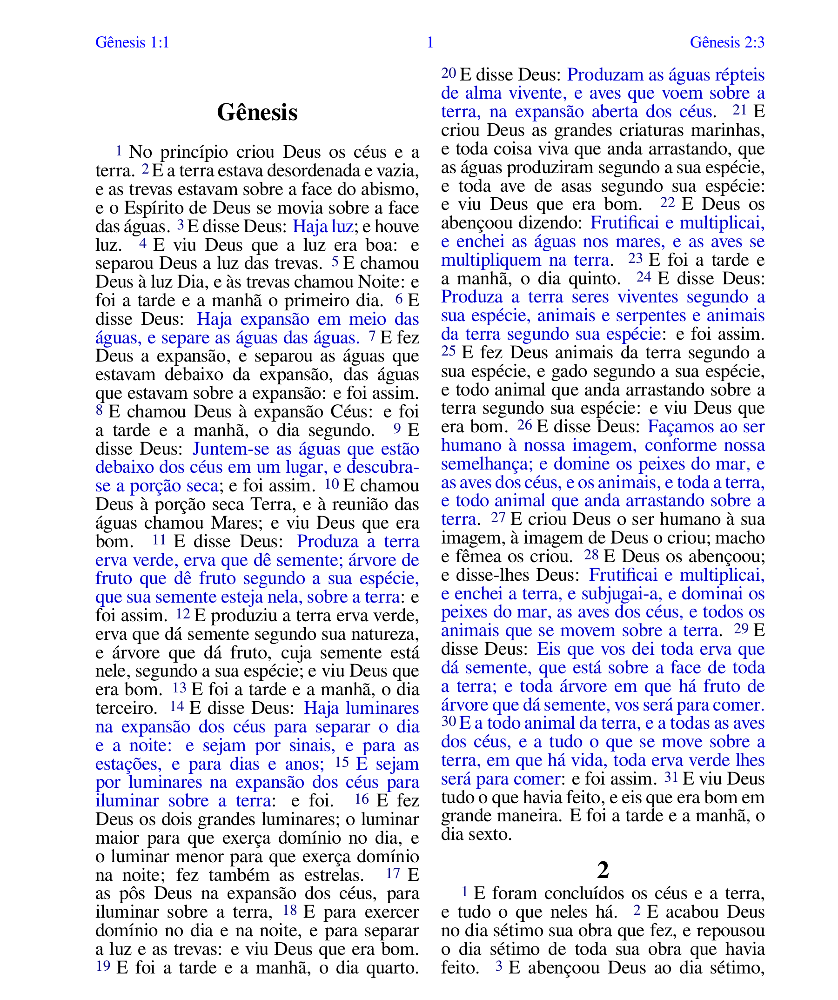

# BibliaLegendada
==================

<!--  -->
</img>

Bíblia Livre com adição de 'legendas'. A legenda consiste no uso de cores para melhor ilustração do discurso de cada personagem. 

## Propósito

Auxiliar leitores na compreensão e cultivar ainda mais o interesse pelos diálogos, parábolas e interlocuções presentes no texto bíblico.

## Ferramentas

O texto é formatado utilizando LaTeX (XeTeX) para uma melhor organização e facilidade de execução de um texto tão imenso e detalhado.

Foram utilizados alguns Shell Scripts com expressões regulares para manipulação de caracteres.

## Versão do Texto Bíblico

Todas as Escrituras em português citadas são da Bíblia Livre (BLIVRE), Copyright © Diego Santos, Mario Sérgio, e Marco Teles, [Bíblia Livre](http://sites.google.com/site/biblialivre/) - fevereiro de 2018. Licença Creative Commons Atribuição 4.0 Brasil [Creative Commons Brasil 4.0](http://creativecommons.org/licenses/by/4.0/br/). Reprodução permitida desde que devidamente mencionados fonte e autores.

<!-- Ela tem como base o <i>Textus Receptus</i> no novo testamento.

## Contribuição

Todo o texto bíblico desta versão é LIVRE para uso. Nenhum valor é cobrado para uso ou download do texto ou do projeto na íntegra.

Existe um desejo de minha parte de criar uma versão impressa junto à uma casa publicadora, sem a necessidade de uma editora. Este projeto, no entanto, é custoso e está aquém do orçamento do projeto.

Àqueles que desejarem, entretanto, apoiar o projeto ou abençoar o meu trabalho podem fazê-lo através das plataformas abaixo listadas:

Pix (Chave Aleatória) ->
BTC ->
